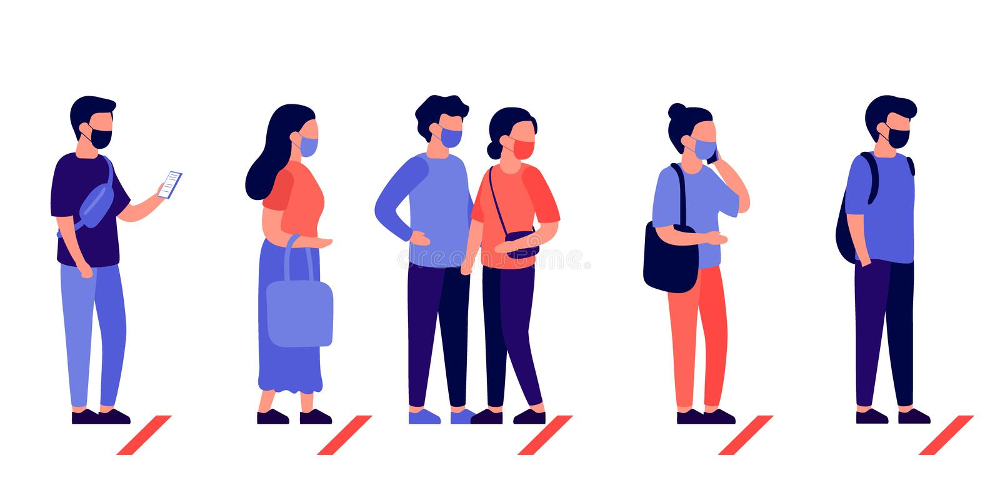

# PROJETO NET_QUEUE
### um Projeto para Gerenciamento de fila ultilizando sockets UDP 

----- Funcionalidades -----  
-> Server para o gerenciamento de clientes onde a fila e gerenciada. # manipulação de dados  
-> Totem para o cadastro de novos Cliente na fila do servidor. # apenas cadastros  
-> Tela para a exibição do proximo da Fila após ser chamado pelo Cliente. #apenas Exibição  
-> Cliente é a pessoa que vai atuar com o atendimendo, podendo chamar o proximo ou podendo ver quantos estão aguardando. 
